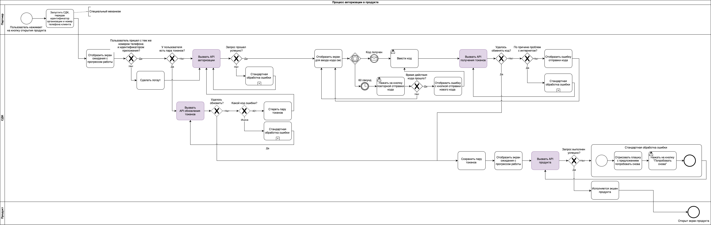

# Sravni SDK

Sravni SDK разработано специально для того, чтобы упростить интеграцию пользовательского флоу компании. Оно позволяет запускать его нативно, напрямую из родительского приложения, тем самым предоставляя конечным пользователям бесшовный доступ к сервису.

Используя наш SDK, вы можете легко добавить функциональность нашей компании в свое приложение без значительных изменений в существующем коде. 

## Требования
Для корректной интеграции SDK партнёру необходимо получить уникальный идентификатор `SDK_KEY` и передать номер телефона конечного пользователя.

-   **SDK_KEY** — уникальный идентификатор, который предоставляется индивидуально каждому партнёру нашей компанией. Этот идентификатор имеет высокий уровень конфиденциальности. Если **SDK_KEY** будет скомпрометирован или устраеет, он будет заблокирован, — таком случае требуется запросить новый.
    
-   **Номер телефона** — мобильный номер телефона конечного пользователя, который используется для его идентификации. При первой авторизации на указанный номер будет отправлен одноразовый пароль (OTP) для подтверждения доступа.
    
> **Примечания:**
> - в текущей версии SDK поддерживаются только номера российского региона (RU);
> - номер телефона должен предоставляться в следующем формате: 70000000000.

## Интеграция
Библиотека поддерживается только на устройствах с **iOS 14** или выше.

### Подключение Sravni SDK

Для подключения Sravni SDK подключите spm-пакет https://github.com/sravni/IOSSravniSDK.

### Запуск Sravni SDK
Запуск процесса идет через создание объекта SravniManager с параметрами ключа активации API (запрашивается в sravni.ru) и номера телефона клиента: 
 ```Swift
SravniManager(
    configuration: .init(key: <ключ ативации SDK>, phoneNumber: <номер телефона клиента>)
) { [weak self] result in
    // тут ваша обработка результата
  }
 ```
После этого можно создать UIViewController, используя метод createViewController класса SravniManager: 
 ```Swift
let viewController = SravniManagerInstance.createViewController()
 ```
Его можно отобразить удобным вам способом.
Для прохождения тестового флоу нужно передать тестовый номер телефона телефона: **70000000000**, и на запрос смс-кода ввести: **1234**.

 
### Получение результатов
Ваш код может быть оповещён о результатах пользовательского флоу через замыкание, передаваемое при создании SravniManager. Варианты описаны внизу этой документации.

## Схема работы SDK

 

SDK будет возвращать через подключенный колбэк следующие варианты ответов:

- **errorInvalidPhoneNumber** — неправильный номер телефона или его формат;
- **errorPartnerClientIdNotSupported** - ключ SDK партнера не распознан;
- **errorPartnerClientIdIsBlocked** - ключ SDK партнера заблокирован;
- **errorUserIsBlocked** - пользователь забокирован;
- **errorAuthError** - у пользователя нет прав доступа к содержимому;
- **errorToManyRequests** - превышено количество запросов;
- **finished** - флоу завершен пользователем.

